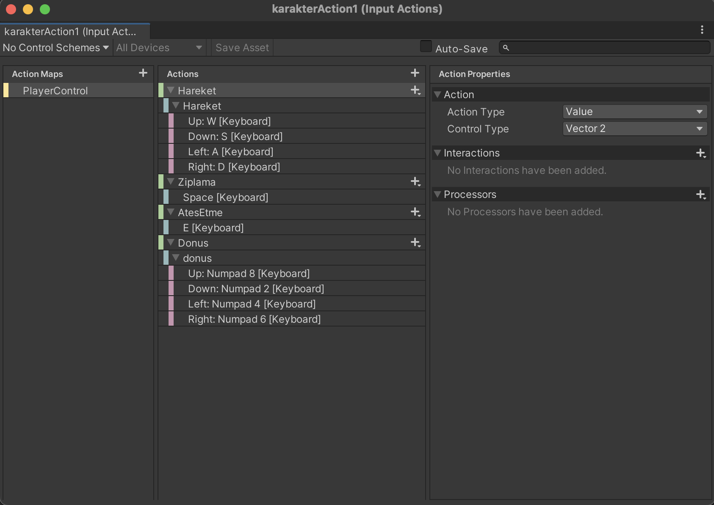
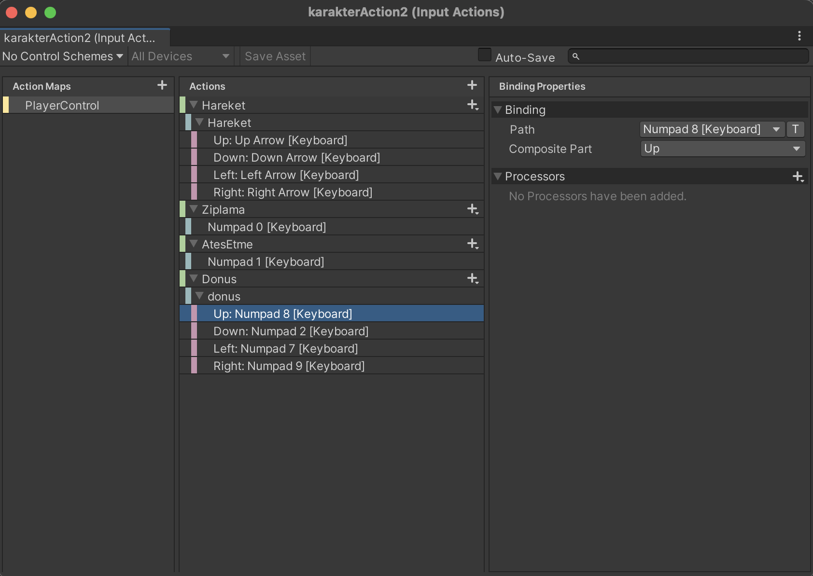

## Input-Sistem
Kullanıcıdan farklı objeleri hareket, rotasyon gibi işlemler için Input Action kullanımı

## Script-Scene Açıklamaları
  * Input Module Scene
    * Joystick işlemleri hareket etme, zıplama, ateş etme...
  * Oyuncu Ornek Scene
    * 2 kişilik oyunlardaki, iki farklı oyuncunun karakterini ayrı şekilde hareket ettirme işlemleri
    * İlk karakter
      * WASD ile ileliyor.
      * Space ile zıplıyor.
      * E tuşu ile ateş ediyor.
      * 4 ve 6 tuşları ile rotasyon işlemleri yapıyor.
    * İlk karakter
      * Yön tuşları ile ileliyor.
      * 0 tuşu ile zıplıyor.
      * 1 tuşu ile ateş ediyor.
      * 7 ve 9 tuşları ile rotasyon işlemleri yapıyor.

## Eğitim Sahneleri
Input Module Scene | Oyuncu Örnek Scene | Karakter 1 Input Action | Karakter 2 Input Action
------------ | ------------- | ------------ | ------------- 
 |  |  | 

