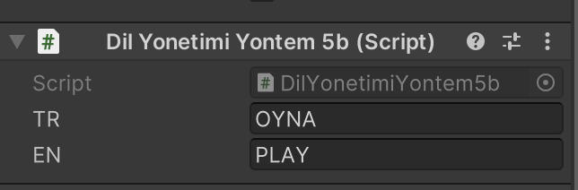

## Çoklu-Dil-Sistemi
Farklı yöntemler ile oyun veya uygulamalarda farklı dil seçenekleri sunabiliriz.

## Script Açıklamaları
  * DilYonetimiYontem1
    * Liste ile alınan Text UI elemanlarının Dropdown seçimine göre Textlerin metinlerinin değişimi...
  * DilYonetimiYontem2
    * Liste ile alınan Text UI elemanlarının Dropdown seçimine göre listelerden Textlerin metinlerinin değişimi...
  * DilYonetimiYontem3a-DilYonetimiYontem3b
    * DilYonetimiYontem3a Script'inde Liste ile alınan Text UI elemanları...
    * DilYonetimiYontem3b Script'inde Liste ile tutulan metinler..
    * DilYonetimiYontem3a Script'inde Dropdown seçimine göre DilYonetimiYontem3b Script'indeki listelerde tutulan metinlere göre Textlerin metinlerinin değişimi...
  * DilYonetimiYontem4a-DilYonetimiYontem4b
    * DilYonetimiYontem4a Script'inde Liste ile alınan Text UI elemanları..
    * DilYonetimiYontem4b Script'ini Text UI elemanlarına tanımlanıyor...
    * Textlere eklenen DilYonetimiYontem4b Script'ine Inspector penceresinden metinsel bilgiler girilir.
    * DilYonetimiYontem4a Script'inde Dropdown seçimine göre DilYonetimiYontem4b Script'i olan tüm Textlerin metinlerinin değişimi...
  * DilYonetimiYontem5a-DilYonetimiYontem5b
    * DilYonetimiYontem4a Script'inde kullanılmak istenen Text UI elemanlarına tag atanıyor. Tag bilgileri sayesinde Text elemanlarına ulaşılıyor.
    * DilYonetimiYontem4b Script'ini Text UI elemanlarına tanımlanıyor...
    * Textlere eklenen DilYonetimiYontem4b Script'ine Inspector penceresinden metinsel bilgiler girilir.
    * DilYonetimiYontem4a Script'inde Dropdown seçimine göre DilYonetimiYontem4b Script'i olan tüm Textlerin metinlerinin değişimi...

## Eğitim Sahneleri
Dil Yonetim Scene | DilYonetimYontem5b Inspector Penceresi |
------------ | ------------ | 
 |  |

